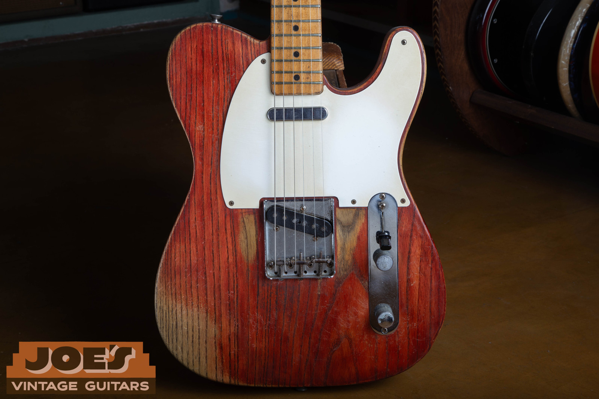
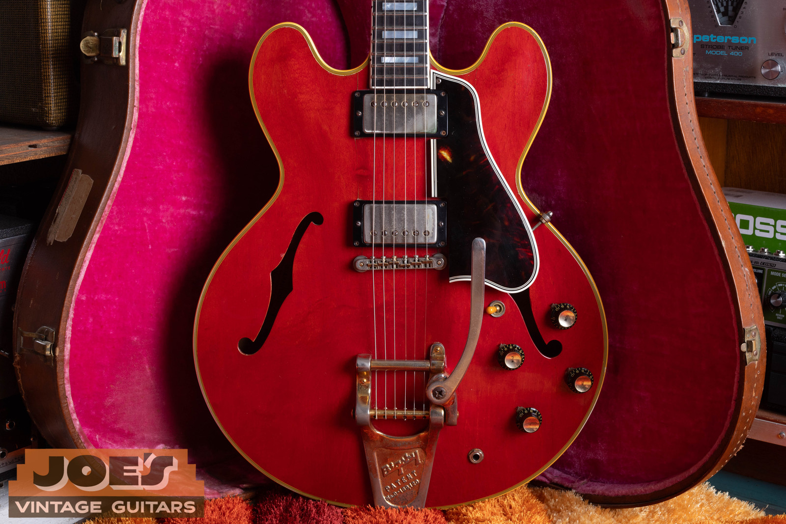
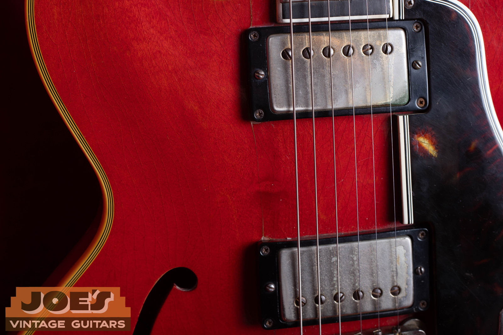
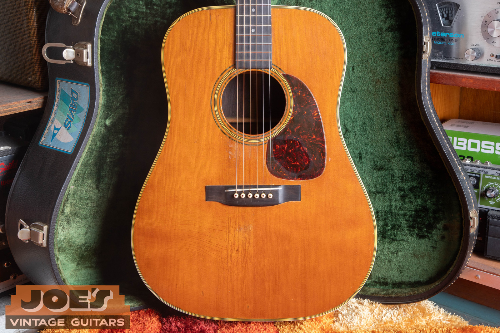
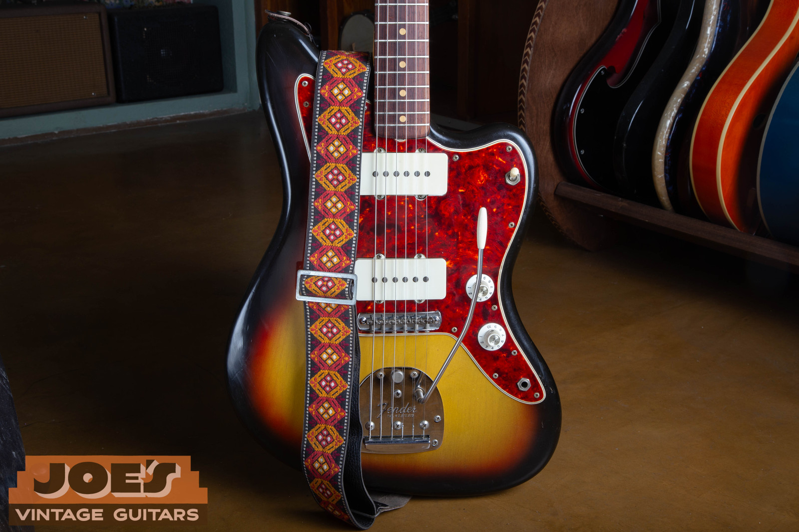
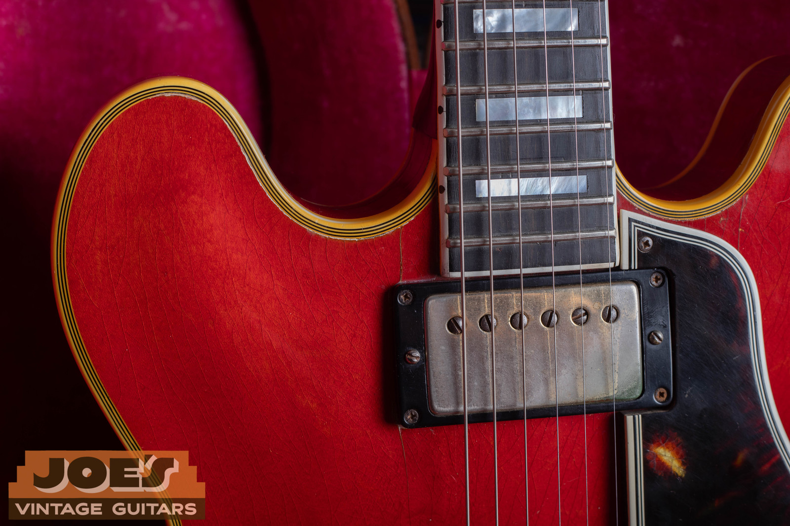

I'm Joe Dampt. I buy vintage Gibsons, Fenders, Martins, and Rickenbackers nationwide from Mesa, Arizona, and I have a 1959 Gibson ES-355 in cherry on the bench. That is the model people are Googling this week. Not because anybody died. Because [Christie's is selling Johnny Marr's guitars](https://www.christies.com/en/auction/auction-24434-cks/overview) in London on Thursday, 17 September 2026.

The guitar in the photos is a shop 1959, cherry, mono, gold Bigsby, pink-lined brown case. It is the model family. It is not Marr's instrument.

<nav class="post-toc-inline" aria-label="Table of contents">

-   [The Short Answer](#short-answer)
-   [This Charming Man Mixup](#charming-man)
-   [The Guitars People Mean](#the-guitars)
-   [1959 vs 1960](#1959-vs-1960)
-   [What They Are Worth](#worth)
-   [If You Inherited One](#inherited)
-   [Frequently Asked Questions](#faq)
-   [Send Me Photos](#send-me-photos)

</nav>

<h2 id="short-answer">The Short Answer</h2>

When people ask what guitar Johnny Marr played, they usually mean four or five instruments, not the whole closet.

The cherry Gibson ES-355 Seymour Stein bought him in early 1984 is the one that wrote [Heaven Knows I'm Miserable Now](https://press.christies.com/wp-content/uploads/2026/06/6c7d2a4700a9977f095fab77370d60df.pdf) and Girl Afraid the same day. Christie's marketing calls it a 1960. The lot card says 1959–60 TDSV. I am not flattening that to one year from a press photo.

The 1982 Rickenbacker 330 in Jetglo is the Smiths-era 330, the one on This Charming Man, What Difference Does It Make?, Still Ill, and Accept Yourself. Marr lent it to Noel Gallagher. It is on the cover of Oasis's Supersonic.

The 1971 Martin D-28 is a six-string. There Is a Light That Never Goes Out, Well I Wonder, Cemetry Gates. It is not a 12-string. The 12-string in the sale is a separate 1976 D-12-28.

The Jaguar people picture him with now is a Fender Johnny Marr Signature in Comet Sparkle, the one on No Time To Die. That is a modern signature, not a 1962–75 Jaguar.

The green Giffin Tele is the Top of the Pops guitar from May 1984. It is not the Charming Man Tele.

Christie's sale is [Marr's Guitars](https://www.christies.com/en/events/marrs-guitars-the-johnny-marr-collection), London, Thursday 17 September 2026, 2pm BST, lots 1–112. Press copy has said about 80 guitars plus amps. The sale list is lots 1 through 112. London viewing runs 9–16 September. The New York viewing already happened.

A 1984 Les Paul Standard is in there too, estimated £80,000–£120,000. I'm not leading with it.

The 1959 cherry 355 on my bench is the model. It is not his.

<h2 id="charming-man">The This Charming Man Mixup</h2>

The intro everybody air-guitars is not "the Rickenbacker."

[The Guardian](https://www.theguardian.com/music/2026/jun/22/johnny-marr-auction-guitars-smiths-this-charming-man-christies-london) said it plainly when the sale was announced: the distinctive opening riff was played on a 1950s Telecaster. [Guitar World](https://www.guitarworld.com/features/johnny-marr-telecasters) has Marr saying the first time he ever used a Tele was the day he recorded This Charming Man, and that the intro is mostly a '54 Tele, maybe '53, that belonged to producer John Porter, tracked with a Rickenbacker. "The sound of that intro was always assumed that it was a Rickenbacker because that is what I was most known for at the time."

Porter's Tele is not in the Christie's sale. I do not have it. I have a 1958 Telecaster on the floor in Mesa, which is the same model family and the wrong year. Marr said Porter's was a refinished '53 or '54. Do not flatten those.

The green Giffin Tele in the sale is a different guitar. Angie bought it as an engagement gift around 1984. It is the one on Top of the Pops in May 1984, and on Meat Is Murder tracks, not the Charming Man intro.

<figure>

<figcaption>A 1958 Fender Telecaster from the shop. Same model family as the Charming Man intro guitar. Marr said John Porter's was a refinished '53 or '54. This is not that guitar, and Porter's Tele is not in the sale.</figcaption>

</figure>

<h2 id="the-guitars">The Guitars People Mean</h2>

I'm not cataloging 112 lots. These are the ones the search is actually about.

<h3 id="es-355">The cherry ES-355</h3>

Seymour Stein bought it for Marr on 48th Street in early 1984 after Marr joked that The Smiths would sign to Sire if Stein got him a new guitar. [Christie's press kit](https://press.christies.com/wp-content/uploads/2026/06/6c7d2a4700a9977f095fab77370d60df.pdf) says the 355 inspired Heaven Knows I'm Miserable Now and Girl Afraid that same day. Estimate £100,000–£150,000.

Marketing copy says 1960 cherry. The lot card says 1959–60 TDSV. TDSV is the stereo Vari-tone version: two channels, the six-position rotary, the choke in the body. The 355 on my bench is a 1959 cherry mono. Four knobs, a toggle, no Vari-tone. I wrote on the [1959 ES-355 guide](/post/1959-gibson-es-355-history-value/) that mono is the more desirable vintage configuration. On Marr's lot, provenance is doing the money work, not the wiring diagram.

<figure>

<figcaption>The 1959 cherry ES-355 on my bench in Mesa. Mono, gold Bigsby, pink-lined brown case. Same model family as Marr's Stein 355. Not his guitar.</figcaption>

</figure>

<figure>

<figcaption>Worn gold covers and lacquer checking on the shop 1959. This is a mono 355: no Vari-tone rotary on the treble bout.</figcaption>

</figure>

<h3 id="rickenbacker-330">The 1982 Rickenbacker 330</h3>

Jetglo, 1982. Estimate £60,000–£80,000. Acquired after the first publishing deal, used hard on the debut album and the early tours, then lent to Noel. I do not have a 330 photo to put here, and I am not going to dress up a 360 or a 4005 bass as one.

If you inherited a Rickenbacker and you need the year, start with the [Rickenbacker serial number guide](/rickenbacker-serial-numbers/). A 1960s 330 and a 1982 330 are not the same market.

<h3 id="martin-d-28">The 1971 Martin D-28, and the 12-string that isn't it</h3>

The 1971 D-28 is a six-string. Estimate £30,000–£50,000. Principal acoustic in the Smiths years: There Is a Light That Never Goes Out, Well I Wonder, Cemetry Gates.

The 12-string in the sale is a 1976 Martin D-12-28, estimated £4,000–£6,000, a separate lot. People mash those together because both say D-28 on the headstock. Count the tuning pegs.

The Martin on my bench is a 1959 D-28. Brazilian-rosewood-era shop guitar. Marr's is 1971 Indian rosewood. Caption that and move on.

<figure>

<figcaption>A 1959 Martin D-28 from the shop. Marr's main Smiths acoustic is a 1971 six-string D-28. This is the earlier model, not his, and it is not a 12-string.</figcaption>

</figure>

<h3 id="jaguar">The Jaguar: signature vs vintage</h3>

The Jaguar in the sale is a Fender Johnny Marr Signature in Comet Sparkle, used on No Time To Die. Estimate £8,000–£12,000. Christie's press kit dates that guitar 2017. The [event page](https://www.christies.com/en/events/marrs-guitars-the-johnny-marr-collection) says 2018. The copy disagrees. Either way it is a modern signature, not a vintage 1962–75 Jaguar.

I have a 1965 sunburst Jaguar in the shop. That is the vintage family: offset body, rhythm circuit on the upper horn, lead switches, claw pickups, floating trem. I wrote the [vintage Fender Jaguar guide](/post/vintage-fender-jaguar-guide/) for that guitar, not for the signature.

<figure>

<figcaption>A 1965 Fender Jaguar from the shop. Vintage 1962–75 family. Not Marr's Comet Sparkle signature, and not a guitar from the sale.</figcaption>

</figure>

<h3 id="giffin-tele">The Giffin Tele</h3>

Roger Giffin korina Tele, green burst, about 1984. Estimate £20,000–£30,000. One-off, brass hardware, the Top of the Pops look. Heard on Meat Is Murder, The Headmaster Ritual, Nowhere Fast. Not the Porter Tele. Not in my shop.

<h2 id="1959-vs-1960">1959 vs 1960</h2>

A late-1959 ES-355 and an early-1960 ES-355 can look identical from across the room. Serials in that window still live on the orange label inside the bass f-hole, A-prefix, and the factory order number can read a year earlier than the serial. That is normal, and it is why I will not call Marr's guitar a definite 1959 or a definite 1960 from a marketing headline.

Christie's says 1960 in the press. The lot card says 1959–60 TDSV. Believe the lot card until you have the guitar in your hands.

The bigger split on a regular 355 is mono versus stereo Vari-tone, not 1959 versus 1960. I already wrote that walk-through on the [1959 Gibson ES-355 history and value guide](/post/1959-gibson-es-355-history-value/). I am not duplicating it here. The shop guitar in these photos is a 1959 cherry mono. Marr's lot is the stereo Vari-tone configuration. Provenance is what turns a £-estimate like that into a different market from the 355 on my bench.

<figure>

<figcaption>Ebony board and pearl blocks on the shop 1959. Those cosmetics are 355, not 335. Dating still takes the label and the FON, which I cover on the 1959 guide.</figcaption>

</figure>

<h2 id="worth">What These Guitars Are Worth Without The Marr Sticker</h2>

Public asking and sold-out dealer pages. Not my offer. Not a bid on your guitar. The market is thin, and asking runs ahead of sold.

A 1959 ES-355TD mono in cherry, all-original, sits about **$30,000 to $45,000** on my own [1959 ES-355 page](/post/1959-gibson-es-355-history-value/). Stereo Vari-tone is lower, roughly $22,000 to $38,000 on that same page. That is a regular 355, no famous-owner story.

A 1960s Rickenbacker 330 is asking about **$4,500 to $8,500** right now. Chicago Music Exchange had a 1966 Fireglo at $4,700. Fretted Americana had a near-mint 1966 at $8,500. An 1980s 330 with no provenance is more like **$2,000 to $4,000**. Thin comps. Don't pretend a 1982 is a 1966.

A 1960s Jaguar in sunburst is about **$4,000 to $8,000** off 1965 Reverb comps. Custom color runs higher. That is the vintage guitar, not the signature.

An early-1970s D-28 in Indian rosewood is asking about **$3,500 to $7,500**. I am not using the 1960–69 Brazilian D-28 table on that guitar. Different wood, different window, different number.

Christie's estimates on the named lots are £100,000–£150,000 for the 355, £60,000–£80,000 for the 1982 330, £30,000–£50,000 for the 1971 D-28, £20,000–£30,000 for the Giffin, and £8,000–£12,000 for the Comet Sparkle Jag. That is provenance money in pounds. It is not what a regular 1959 355 or a 1960s 330 trades for, and it is not a bid.

If you want a number on the guitar in your closet, send photos. The [appraisal is free](/free-appraisal/) and there is no obligation to sell.

<h2 id="inherited">If You Inherited One</h2>

Funnel this by what you actually have, not by the auction catalog.

If it is a vintage ES-355, ES-345, or ES-335, I buy those. Start on the [Gibson buying page](/sell-my-gibson-guitar/) and read the [1959 ES-355 guide](/post/1959-gibson-es-355-history-value/) before you guess the year. Leave the gold plating and the Vari-tone alone.

If it is a 1960s Rickenbacker 330, I buy vintage Rickenbackers. Use the [Rickenbacker serial number guide](/rickenbacker-serial-numbers/) and the [Rickenbacker buying page](/sell-my-rickenbacker-guitar/). A 1982 330 is outside the vintage window I advertise. I will still look at photos. I am not going to talk about it like it is a 1966.

If it is a 1962–75 Jaguar, or a 1950s Telecaster, I buy vintage Fenders. The [Jaguar guide](/post/vintage-fender-jaguar-guide/) and the [Fender buying page](/sell-my-fender-guitar/) are the right doors. A Johnny Marr signature Jaguar is not a vintage Jaguar. I do not buy 2017/2018 signatures as vintage.

If it is a vintage Martin dreadnought, I buy those from the [Martin buying page](/sell-my-martin-guitar/). A 1971 D-28 is outside the vintage window I advertise. It is not the 1960s Brazilian-rosewood table. I will still date it from the neck-block stamp if you send the photo.

I buy in all 50 states from Mesa. I handle packing and insured shipping if we can't meet here.

Call or text (602) 900-6635 or email joesvintageguitars94@gmail.com.

<h2 id="faq">Frequently Asked Questions</h2>

<h3 id="what-guitar-did-johnny-marr-play">What Guitar Did Johnny Marr Play?</h3>

A handful, not one. The Stein cherry ES-355 wrote Heaven Knows I'm Miserable Now. The 1982 Rickenbacker 330 is the early-Smiths 330. The 1971 Martin D-28 is the six-string acoustic on There Is a Light. The Jaguar most people picture now is his signature model. The green Giffin is the Top of the Pops Tele, not the Charming Man Tele.

<h3 id="was-this-charming-man-played-on-a-rickenbacker">Was This Charming Man Played On A Rickenbacker?</h3>

Partly. The intro is mostly John Porter's 1950s Telecaster tracked with a Rickenbacker. Marr said so in Guitar World. The Guardian repeated it when the sale was announced. The 1982 330 is on the record. It is not "the intro guitar."

<h3 id="is-johnny-marrs-es-355-a-1959-or-a-1960">Is Johnny Marr's ES-355 A 1959 Or A 1960?</h3>

Christie's marketing says 1960. The lot card says 1959–60 TDSV. I am not picking one from a headline. The shop guitar in these photos is a 1959 cherry mono. His is the stereo Vari-tone configuration.

<h3 id="is-the-1971-d-28-a-12-string">Is The 1971 D-28 A 12-String?</h3>

No. The 1971 D-28 is a six-string. The 12-string in the sale is a 1976 D-12-28, a separate lot.

<h3 id="is-the-giffin-tele-the-charming-man-tele">Is The Giffin Tele The Charming Man Tele?</h3>

No. Charming Man used Porter's '53 or '54 Tele. The Giffin is a mid-80s one-off, the Top of the Pops guitar. Porter's Tele is not in the sale.

<h3 id="what-is-a-vintage-es-355-worth-without-johnny-marr-provenance">What Is A Vintage ES-355 Worth Without Johnny Marr Provenance?</h3>

On my 1959 page, a clean original mono 1959 is about $30,000 to $45,000 in public asking. Stereo is lower. Christie's £100,000–£150,000 estimate is provenance, not that market.

<h3 id="will-you-buy-a-1971-d-28-or-a-1982-330-or-a-signature-jaguar">Will You Buy A 1971 D-28, A 1982 330, Or A Signature Jaguar?</h3>

Those three sit outside the vintage windows I advertise. Send photos anyway if you want a read. I buy vintage ES-355s, 1960s Rickenbacker 330s, 1962–75 Jaguars, 1950s Teles, and vintage Martins.

<h3 id="when-is-the-christies-johnny-marr-auction">When Is The Christie's Johnny Marr Auction?</h3>

Thursday 17 September 2026, 2pm BST, Christie's London, lots 1–112. London viewing 9–16 September. New York viewing is over.

<h2 id="send-me-photos">Send Me Photos</h2>

If you want the short version on your guitar, send photos. Front, back, headstock, the label or serial, and anything that looks like a Vari-tone, a toaster pickup, or a neck-block stamp. I'll tell you the model and give you a current market read. Use the [free appraisal form](/free-appraisal/), or text me at (602) 900-6635.

I'm Joe Dampt. I buy, sell, and appraise vintage instruments in Mesa, Arizona. I've been doing this full-time for more than twelve years. If you want me to look at the guitar in the case, that's the appraisal form.

Who I am and how I work is on the [about page](/about-me/).

<h3 id="disclaimer">Disclaimer</h3>

**Value estimate.** This is an estimate of market value, not an offer to buy and not a guarantee. Market values fluctuate. Have your specific item appraised. The dollar figures above are public-market asking and sold ranges without Marr provenance, not a bid on your guitar and not Christie's estimates converted into dollars.

**Originality judgment.** Originality is assessed from the information provided. A hands-on inspection can change the conclusion. A photo read is not a certificate that a guitar belonged to a named player. None of the shop photos in this post are Johnny Marr's instruments.

**Results vary.** Past results do not guarantee a similar outcome. Each guitar depends on its own facts. The Christie's sale has not happened. Do not treat estimates as hammers.

<!--
## Citation Ledger

Scope Firewall: Marr search intent, Christie's 17 Sept 2026 sale, and shop model-family photos only. No hammers. No invented serials. Shop photos are not Marr's instruments.

| Claim (As Written In Draft) | FactID | Authority | Jurisdiction | publicFacingSafe | verifyWithExpert | lastVerified | Status |
|---|---|---|---|---|---|---|---|
| Sale: Marr's Guitars, Christie's London, Thu 17 Sept 2026, 2pm BST, lots 1-112. | CHRISTIES-24434 | christies.com/en/auction/auction-24434-cks/overview | GLOBAL | true | false | 2026-08-27 | OK |
| About 80 guitars plus amps; sale lists lots 1-112. Press also said ~95 lots / 85 / 90. Hedged. | CHRISTIES-PRESS | press.christies.com Marr's Guitars; overview lots 1-112 | GLOBAL | true | false | 2026-08-27 | OK |
| London viewing 9-16 Sept. NY viewing 25 June-1 July, already over. | CHRISTIES-VIEW | press kit; event page | GLOBAL | true | false | 2026-08-27 | OK |
| 1960 cherry ES-355 / lot card 1959-60 TDSV. Stein gift early 1984, Heaven Knows + Girl Afraid same day. Est £100k-150k. | CHRISTIES-355 | press PDF; Christie's stories lot card | GLOBAL | true | false | 2026-08-27 | OK |
| Mono more desirable than stereo Vari-tone on a regular 355. | JVG-355 | /post/1959-gibson-es-355-history-value/ | GLOBAL | true | false | 2026-08-27 | OK |
| 1982 Rick 330 Jetglo £60k-80k. Charming Man etc. Lent to Noel; Oasis Supersonic cover. | CHRISTIES-330 | press kit; Guardian | GLOBAL | true | false | 2026-08-27 | OK |
| Charming Man intro mostly Porter's '53/'54 Tele tracked with a Rick. Not "the Rickenbacker." Porter Tele not in the sale. | GW-GUARDIAN | guitarworld.com/features/johnny-marr-telecasters; Guardian 22 Jun 2026 | GLOBAL | true | false | 2026-08-27 | OK |
| 1971 Martin D-28 SIX-string £30k-50k. There Is a Light, Well I Wonder, Cemetry Gates. | CHRISTIES-D28 | press kit | GLOBAL | true | false | 2026-08-27 | OK |
| 1976 D-12-28 £4k-6k, separate lot, not the 1971 six-string. | CHRISTIES-D1228 | Christie's lot; LiveAuctioneers catalog | GLOBAL | true | false | 2026-08-27 | OK |
| Fender Johnny Marr Signature Comet Sparkle. Press 2017 / event page 2018. No Time To Die. Est £8k-12k. Not vintage 62-75. | CHRISTIES-JAG | press PDF (2017); event page (2018) | GLOBAL | true | false | 2026-08-27 | OK |
| Giffin korina Tele ~1984 £20k-30k. TOTP May 1984. Not Charming Man Tele. | CHRISTIES-GIFFIN | press kit; Guitar World | GLOBAL | true | false | 2026-08-27 | OK |
| 1984 LP Standard £80k-120k, mention in passing. | CHRISTIES-LP | press kit | GLOBAL | true | false | 2026-08-27 | OK |
| Shop photos: 1959 cherry ES-355 mono, 1965 Jaguar, 1958 Tele, 1959 D-28. Model family, not Marr's. | LIVE-PHOTO | Drive shop photos; captions | GLOBAL | true | false | 2026-08-27 | OK |
| 1959 ES-355 mono $30,000-$45,000; stereo $22,000-$38,000. Public, not a bid. | JVG-355-VALUE | /post/1959-gibson-es-355-history-value/ | GLOBAL | true | true | 2026-08-27 | RANGE, NOT A BID |
| 1960s Rick 330 asking ~$4,500-$8,500 (CME $4700, Fretted Americana $8500). 1980s 330 no provenance ~$2k-4k. Thin. | PUBLIC-330 | CME 1966 $4700; Fretted Americana 1966 $8500 | GLOBAL | true | true | 2026-08-27 | RANGE, THIN |
| 1960s Jaguar sunburst ~$4,000-$8,000 from Reverb 1965 comps. Custom color higher. | PUBLIC-JAG | Reverb 1965 Jaguar comps | GLOBAL | true | true | 2026-08-27 | RANGE, NOT A BID |
| Early-70s D-28 Indian rosewood ~$3,500-$7,500 asking. Not the 1960-69 Brazilian table. | PUBLIC-D28 | Public asking; do not use JVG 60s Brazilian table | GLOBAL | true | true | 2026-08-27 | RANGE, NOT A BID |
| 1971 D-28 / 1982 330 / signature Jag outside Joe's advertised vintage windows. | LIVE-PAGE | /sell-my-martin-guitar/ /sell-my-rickenbacker-guitar/ /sell-my-fender-guitar/ | GLOBAL | true | false | 2026-08-27 | OK |
| Joe Dampt, Mesa, (602) 900-6635, joesvintageguitars94@gmail.com, more than twelve years full-time. | LIVE-PAGE | /about-me/ | GLOBAL | true | n/a | live | OK |
-->
