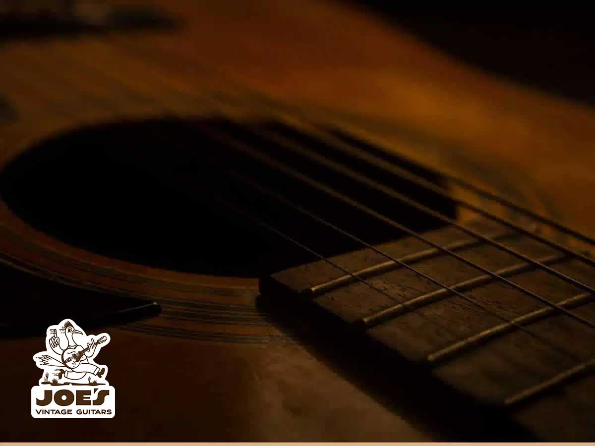

Table Of Contents

-   [A Seller’s Guide On Vintage Guitars](#a-sellers-guide-on-vintage-guitars)
-   [What Is A Vintage Guitar?](#what-is-a-vintage-guitar)
-   [The Step-By-Step On Selling A Vintage Guitar](#the-step-by-step-on-selling-a-vintage-guitar)
-   [Where Can I Sell Vintage Guitars In Arizona?](#where-can-i-sell-vintage-guitars-in-arizona)
-   [Find Your Vintage Guitar With A Top-Rated Specialist](#find-your-vintage-guitar-with-a-top-rated-specialist)

<h2 id="a-sellers-guide-on-vintage-guitars">A Seller’s Guide On Vintage Guitars</h2>

Are you looking to sell [vintage guitars in Mesa](/)? If yes, then you should consider some things first, including the guitar’s quality.

The guitar has become a symbol of music lovers around the globe. There are many types of guitars out there, each one with its unique features.

From colorful guitars with powerful sounds to more minimalistic designs, there are many guitars to choose from, so you must be mindful of what you’re offering.

Maybe you want to sell an instrument that matches a specific style, or maybe you just want cash for a valuable item. Either way, we’ve put together these tips on how to sell a vintage guitar successfully.  
  

<h3 id="what-is-a-vintage-guitar">What Is A Vintage Guitar?</h3>

You may have heard the word ‘vintage’ before, as it is quite common these days. Sometimes, it refers to the style of an instrument; it could be the modern design of an old model, making it look and sound similar but lacking the heritage of the real guitar.

In short, a vintage guitar refers to guitars from the late 80s, 70s, 60s, and even older. The guitar should be at least 30 years old to be considered vintage.

Whether they’ve been played by expert guitarists or left in the corner of a garage, [vintage guitars in Mesa](/) are unique relics representing important eras of music.

<h3 id="the-step-by-step-on-selling-a-vintage-guitar">The Step-By-Step On Selling A Vintage Guitar</h3>

Now that you know the basics of selling your guitar check below the seven factors you need to consider to sell it successfully.

#### See If Your Guitar Has All Its Original Parts

Guitars are constantly modified by avid guitarists. Many of them continually modify their instruments to get new sounds and styles. Unfortunately, that means these guitars are far from their original state.

The most common additions include control knobs, bridges, pickups, and tuning machines. These parts might improve the sound quality, but they also reduce the guitar’s value. The more original parts you keep in your guitar, the higher its value.

#### Check The Guitar’s Headstock

If you are an avid guitarist, you may already know what a headstock is. The headstock is the angle part of the guitar’s head where strings are attached. It must resist a lot of pressure, so it is particularly vulnerable to breaking (a common issue with Gibson guitars).

You can see if that has happened to the vintage guitar by checking if there’s a small fracture line between the neck and the headstock.

If you want to sell the guitar to a guitar player, you should not worry about that; headstock breaks are common, and experts don’t have issues repairing them.

Nevertheless, if you’re trying to sell it to a collector of [vintage guitars in Mesa](/), you should be aware of these fractures as they reduce the value of the instrument.

#### Are You Selling A ‘Refinished’ Guitar?

You should also inform the seller about the finish of the guitar. If your guitar has the ‘refinish’ label on it, it means it has received a paint job at some point in its lifetime. In that case, the guitar’s value will be significantly reduced.

Guitar collectors prefer original finishes because they usually reflect trends of the period in which the guitar was made. For example, Fender offers popular colors like ‘Sherwood Green’ and ‘Candy Apple Red’ in the ’60s to resemble the popularity of the American car industry.

If you want to sell a vintage guitar to guitarists and not collectionists, you shouldn’t worry too much about the finish.

#### What Are The Most Valuable Vintage Guitars?

The value of a vintage guitar depends on its condition and provenance. However, some models never seem to decrease their value. One is Gibson’s Cherry Sunburst Les Paul Standards, which was produced from 1958 to 1960.

Their original price was around $280, but they now regularly go to auction for more than $400,000. That’s because they have incredible craftsmanship, and only about 1,700 were ever made.

<h3 id="where-can-i-sell-vintage-guitars-in-arizona">Where Can I Sell Vintage Guitars In Arizona?</h3>

-   **Guitar Shops:** Independent guitar shops can be an excellent alternative to offer valuable vintage guitars, although you will probably receive less money than elsewhere.
-   **Online:** You can also sell vintage guitars of all qualities on traditional auction sites.
-   **Guitar Conventions:** Although less common, conventions are good for selling vintage guitars in one go.
-   **Guitar Expert:** Selling a guitar to an expert is probably the best way to get money without any inconvenience. An expert will check your guitar in the best way possible to ensure a suitable deal for you.

<h3 id="find-your-vintage-guitar-with-a-top-rated-specialist">Find Your Vintage Guitar With A Top-Rated Specialist</h3>

Before you commit to any of these routes, it is worth reading the [mistakes to avoid when selling a vintage guitar](/post/mistakes-to-avoid-when-selling-a-vintage-guitar/) and comparing what each of the [best online platforms for selling vintage guitars](/post/best-online-platforms-sell-vintage-guitars/) actually costs you in fees.

Are you ready to sell a vintage guitar? Do you simply want to know what your guitar is worth? Luckily, you can count on [Joe’s Vintage Guitar](/). At Joe’s Vintage Guitar, you won’t need more than a few minutes to determine your instrument’s current value. You’ll also be able to choose the best vintage guitar for your collection or your hobby. [Visit our website to get started!](/contact-me/)
